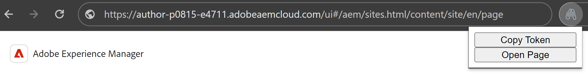

# login-token copy extension
AEM quicksite creation using the local node live proxy to an AEM environment needs a login token.
It is fairly easy when local users are available, but not when everything is SSO via IMS and local users are not allowed.

To use the live proxy using such environments as well, the login-token cookie needs to be copied to localhost.

This can be a tedious process. This Extension does the job for you.

## Installation
clone this repository and then follow the steps on the chrome developers documentation:
https://developer.chrome.com/docs/extensions/mv3/getstarted/development-basics/#load-unpacked

## Usage
Once installed, navigate to your AEMaaCS instance and click on the plugin icon.
The button to execute the copy action is opened.

